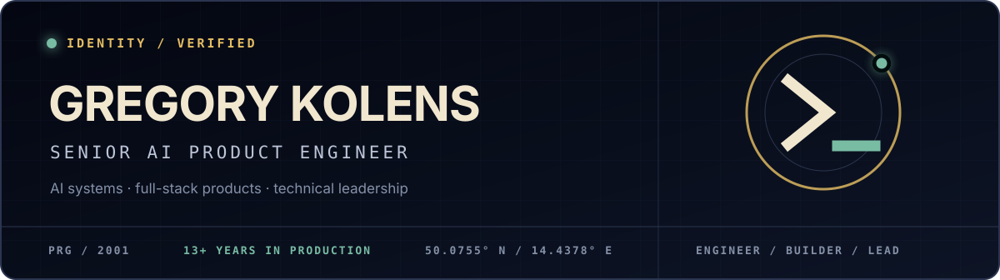

  

  
  
  

I design and ship **production AI systems, full-stack products, and developer tools**. My work sits where product thinking, software architecture, and hands-on engineering meet — turning ambitious prototypes into systems teams can operate reliably.

Currently building agentic real-estate workflows as **Co-founder & Lead Engineer at Dealyv**, while working as a **Senior Technical Lead at PwC**. More than 13 years in software, still happiest close to the code.

## `01 / FOCUS`

| AI product systems | Full-stack engineering | Technical leadership |
| --- | --- | --- |
| Agentic workflows, LLM orchestration, RAG, structured outputs, evaluation loops | Production applications and APIs with TypeScript, React, Next.js, Node.js, and Python | Architecture, mentoring, delivery planning, and product decisions grounded in implementation |

## `02 / SELECTED WORK`

| Project | Signal |
| --- | --- |
| **[react-slot-component](https://github.com/kolengri/react-slot-component)** | Type-safe, Vue-like slots for React components |
| **[worker-batcher](https://github.com/kolengri/worker-batcher)** | Controlled concurrency and batch processing for arrays |
| **[react-lazy-flags](https://github.com/kolengri/react-lazy-flags)** | Lazy-loaded country flags for React using Suspense |
| **[make-route-path](https://github.com/kolengri/make-route-path)** | Type-safe route generation for frontend routers |
| **[strategy-calculator](https://github.com/kolengri/strategy-calculator)** | Interactive investment strategy calculator · **[live demo](https://strategy-calculator.vercel.app)** |
| **[3d-printable-velcro](https://github.com/kolengri/3d-printable-velcro)** | Parametric 3D-printing experiment built with OpenSCAD |

## `03 / TOOLKIT`

`Python` · `TypeScript` · `React` · `Next.js` · `Node.js` · `Pydantic AI` · `LLM systems` · `Rust` · `OpenSCAD`

## `04 / OPERATING PRINCIPLES`

- **Make complexity legible.** Good systems explain themselves to users and engineers.
- **Design for the day after the demo.** Evaluation, observability, failure modes, and maintainability are product features.
- **Build the smallest useful abstraction.** Type safety and focused APIs should remove friction, not add ceremony.

  AVAILABLE FOR SELECT WORK · PRAGUE / CZECHIA · <a href="https://hello-world.cz">HELLO-WORLD.CZ</a>

